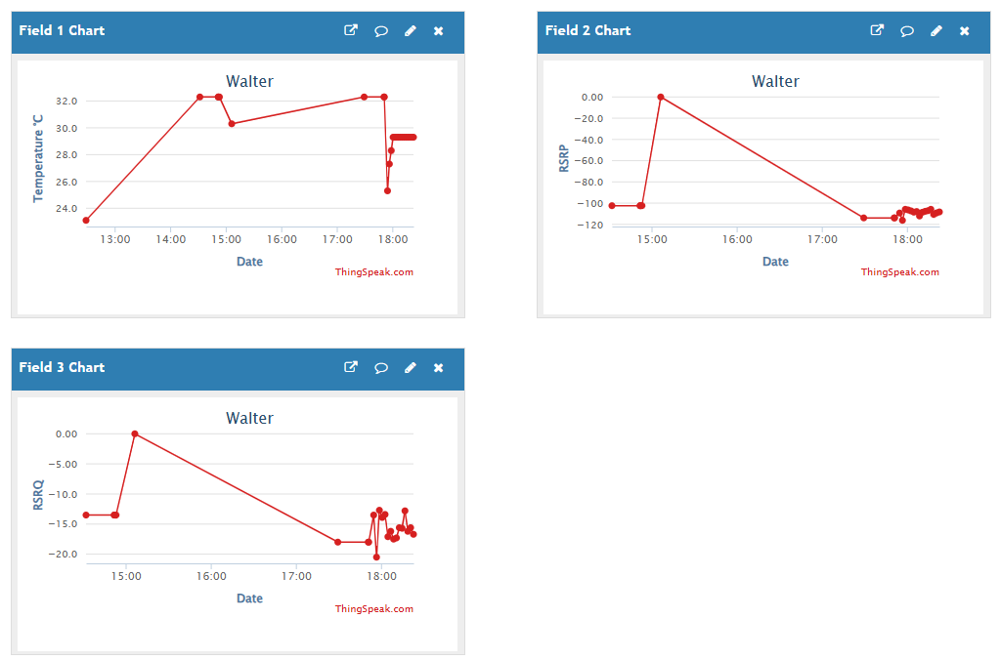

# ThingSpeak MQTT example

## Purpose

This sketch uploads MQTT data to ThingSpeak via MQTT as you can see on this public example
dashboard: https://thingspeak.mathworks.com/channels/3004646

## Required hardware

To run this example you will need the following items:
 - Walter
 - An LTE antenna
 - A SIM card
 - USB-C cable to flash Walter

## Required Software

Please follow the instructions from the [documentation](https://www.quickspot.io/index.html)
to [install](https://www.quickspot.io/documentation.html#/walter-modem/setup/arduino) the modem
library and [setup](https://www.quickspot.io/documentation.html#/developer-toolchains/arduino) the
Arduino IDE for use with Walter.

## Run the example

Register an account on [ThingSpeak](https://thingspeak.mathworks.com/login?skipSSOCheck=true) and 
create a channel and a device. Make sure to save your device's client id, username and password. You
will need to enter these credentials in the sketch. You also need to authorize your device to 
publish data to your newly created channel.

Your channel will have a `channel id` which you also need to enter into the sketch. The sketch
assumes a channel with 3 fields:
 1. Field 1: temperature in °C
 2. Field 2: RSRP
 3. Field 3: RSRQ

Make sure to connect the LTE antenna to Walter. Running the example without the
antenna connected could damage the radio frontend of the modem. Also insert the
SIM card before starting the sketch.